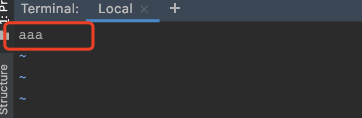

# grep命令介绍

## 1.功能概述

**文本搜索工具**

| 参数    | 含义                                                         | 示例                   |
| ------- | ------------------------------------------------------------ | ---------------------- |
| -i      | 忽略大小写，即 ignore case                                   | grep -i a.txt          |
| -v      | 反过来（invert），只打印没有匹配的                           | grep -v 'a' a.txt      |
| -n      | 打印行号                                                     | grep -n 'a' a.txt      |
| -w      | 单词匹配，即不能部分匹配。示例中 liker，alike 都不匹配       | grep -w 'like' a.txt   |
| -c      | 显示匹配的行数                                               | grep -c 'a' a.txt      |
| -o      | 只显示被模式匹配到的字符串。**不被模式匹配的字符会被截取后舍弃** | grep -E -o 'a+b' a.txt |
| --color | 匹配的内容以高亮颜色显示                                     | grep 'a' a.txt --color |
| -A      | 显示匹配到的字符串所在的行及其后n行，after                   | grep 'a' -A 3 a.txt    |
| -B      | 显示匹配到的字符串所在的行及其前n行，before                  | grep 'a' -B 3 a.txt    |
| -C      | 显示匹配到的字符串所在的行及其前后各n行，context             | grep 'a' -C 3 a.txt    |
| -E      | 使用扩展正则表达式                                           | grep -E 'a+b' a.txt    |
| -F      | 忽略正则表达式                                               | grep -F 'a' a.txt      |


## 2.用法示例-常规用法

1. 文件内容 a.txt

```bash
aa b
a b
AB
111
222
333
aaa
bbb
ccc
aab
123abc
abc123
1a2b3c
abb
bbc
abc
1.3
```

### 1.查找匹配行

1. 查找含有字符a的行

```bash
 cat a.txt| grep "a"
 cat a.txt| grep a
 grep a a.txt
```

>  以上三种写法均可，依据个人喜好

### 2.查找不匹配行 -v

1. 查找含有字符a，但是不含有字符c的行

```bash
cat a.txt| grep a | grep -v c
```

### 3.忽略大小写  -i

1. 查找含有字符a的行，忽略大小写

```bash
cat a.txt| grep -i a 
```

### 4.匹配字符添加颜色显示 --color

1. 查找含有字符a的行，同时添加颜色显示

```bash
 cat a.txt| grep a --color 
```

### 5.显示匹配的前m，后n行

1. 查找含有字符a的行，同时显示前1行，后2行的数据

```bash
cat a.txt| grep a -B 1 -A 2
```

- -B ，显示匹配到的字符串所在的行及其前m行，before
- -A，显示匹配到的字符串所在的行及其后n行，after
- -C， 显示匹配到的字符串所在的行及其前后各n行

### 6.显示行号 -n

1. 查找含有字符a的行，同时显示所在文件的行号

```bash
cat a.txt | grep -n a 
```

### 7.递归查找路径下所有文件  -r

1. 查找当前目录及自目录下，含有字符串a的文件

语法：

```bash
grep -r 查找关键字 查找目录
```

示例：

```bash
grep -r 'a' --color  ./*  # -r 代表递归查找

=======> 执行结果：

./a.txt:aaa
./a.txt:aab
./a.txt:123abc
./a.txt:abc123
./a.txt:1a2b3c
./a.txt:abb
./a.txt:abc
./always.txt:aaa
./auto.txt:aaa
./dir_b/b.txt:abc
```


## 3.用法示例-正则表达式

### 1.普通正则表达式

语法：` grep '正则表达式'`

```bash
cat a.txt| grep '[0-9]' --color  # 1、查找含有数字的行
cat a.txt| grep '[a-z]' --color  # 2、查找含有子的行
cat a.txt| grep 'a.*' --color  # 3、查找含有字母a的行
cat a.txt| grep 'a+' --color # 4、查找至少含有一个字母a的行，执行结果正确吗？
```

### 2.扩展正则表达式

语法：` grep -E '正则表达式'`  

- `+`和`?` 需要使用**扩展**正则表达式；
- 其他正则符号，默认支持，但可能需要使用转义符`\` 

```bash
cat a.txt| grep -E 'a+' --color  # 1、查找至少含有一个字母a的行
cat a.txt| grep -E 'a?b' --color  # 2、查找含有0或者1个字母a，后面跟着字母b的行
```

### 3.忽略正则表达式

语法： `grep -F '搜索字符'`

```bash
cat a.txt | grep -F '1.3' --color  
```


## 4.综合运用

### 1.查找a.txt中，含有字母a，但是不含有字母b的数据，并显示行号

1. 执行命令：

```bash
 cat a.txt| grep -n 'a'  | grep -v 'b' # 命令一
 cat a.txt| grep  'a'  | grep -n -v 'b' # 命令二，注意观察区别
```

- grep 命令可以多次使用，使用管道符号进行分割
- -n **添加在不同的位置，输出的结果不同**。-n是以当前数据所在的行号，做为显示的。

### 2. 关于 --color 失效的问题

> 只有在自己非常了解 --color=always的弊端时，才使用此选项。否则使用默认的 --color=auto ，可以避免产生一些意外的问题。

1. 基本选项

- always（任何情况下，都添加颜色标记）
- Never6-
- auto （只有在输出到终端时，才显示颜色）

2. 用法 

   以下示例，演示 `--color=always` 和  `--color=auto` 的区别：

```bash
cat a.txt| grep 'a' --color  | grep -v 'b'
cat a.txt| grep 'a' --color=always  | grep -v 'b'

======>从输出结果上看：
--color=always 选项的语句，显示结果中显示了颜色。
--color=auto 选项的语句，没有显示颜色。
```

3. 查看区别

```bash
cat a.txt| grep 'a' --color=always  | grep -v 'b'  > always.txt
cat a.txt| grep 'a' --color  | grep -v 'b'  > auto.txt
```

`vi always.txt` 的结果：（虽然显示了颜色，但是数据不正常）


从截图中可以看到，添加 --color=always后，会将查询结果，添加颜色标记，多一些意料之外的字符。 4e80ae76 变成了4e80**^[[01;31m^[[K**ae**^[[m^[[K**76, 可能会导致查询结果不准确。(其中加粗的字符就是额外字符)。


`vi auto.txt`的结果：（虽然没显示颜色，但是数据正常）



而 --color=auto命令，**只有在显示到终端**时，才添加颜色标记，避免了结果不准确。

