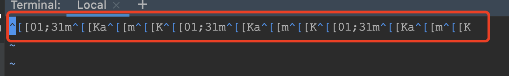

# grep命令介绍

## 1.功能概述

参照 

[grep命令]: https://www.cnblogs.com/flyor/p/6411140.html


## 2.用法示例

1. 文件内容 a.txt

```bash
111
222
333
aaa
444
555
bbb
ccc
aab
abb
bbc
abc
```

### 1.查找匹配行

1. 查找含有字符a的行

```bash
 cat a.txt| grep "a"
 cat a.txt| grep a
 grep a a.txt
```

### 2.查找不匹配行

1. 查找含有字符a，但是不含有字符c的行

```bash
cat a.txt| grep a | grep -v c
```

### 3.忽略大小写

1. 查找含有字符a的行，忽略大小写

```bash
cat a.txt| grep -i a 
```

### 4.匹配字符添加颜色显示

1. 查找含有字符a的行，同时添加颜色显示

```bash
 cat a.txt| grep a --color 
```

### 5.显示匹配的前m，后n行

1. 查找含有字符a的行，同时显示前1行，后2行的数据

```bash
cat a.txt| grep a -B 1 -A 2
```

- -B ，显示匹配到的字符串所在的行及其前m行，before
- -A，显示匹配到的字符串所在的行及其后n行，after
- -C， 显示匹配到的字符串所在的行及其前后各n行

### 6.显示行号

1. 查找含有字符a的行，同时显示所在文件的行号

```bash
cat a.txt | grep -n a 
```

### 7.递归查找路径下所有文件

1. 查找当前目录及自目录下，含有字符串a的文件

语法：

```bash
grep -r 查找关键字 查找目录
```

示例：

```bash
grep -r a /home/yimiqidage/grep # -r 代表递归查找

=======> 执行结果：

/home/yimiqidage/grep/test/c.txt:aabbcc
/home/yimiqidage/grep/a.txt:aaa
/home/yimiqidage/grep/a.txt:aab
/home/yimiqidage/grep/a.txt:abb
/home/yimiqidage/grep/a.txt:abc
/home/yimiqidage/grep/b.txt:abc
```


## 3.综合运用

### 1.查找日志中，名字中含有ae，但是不含有fb的名字，并显示行号

> grep 命令可以多次使用，使用管道符号进行分割

1. 执行命令：

```bash
cat business.log | grep -n "My name " | grep  "ae" | grep -v  "fb" 
```

- -n 添加在不同的位置，输出的结果不同。-n是以前面的输入，为行号显示的。
- -v 显示不符合当前查询结果的数据

2. 结果对比：

```bash
cat business.log | grep -n "My name " | grep  "ae"  
======> 执行结果：
153:2020-07-11 09:41:02,661 INFO  [http-nio-8080-exec-1] com.ttshixi.git.logs.LogCreate : My name is ae3fd4b9,My age is java.util.Random@465bdea7
...
2551:2020-07-11 09:55:25,682 INFO  [http-nio-8080-exec-1] com.ttshixi.git.logs.LogCreate : My name is 40c49e33,My age is java.util.Random@1e4699ae
2709:2020-07-11 09:55:26,014 INFO  [http-nio-8080-exec-1] com.ttshixi.git.logs.LogCreate : My name is fbf33852,My age is java.util.Random@64ae64d8


cat business.log | grep -n "My name " | grep  "ae"  | grep -v  "fb"  
======> 执行结果：
153:2020-07-11 09:41:02,661 INFO  [http-nio-8080-exec-1] com.ttshixi.git.logs.LogCreate : My name is ae3fd4b9,My age is java.util.Random@465bdea7
...
2551:2020-07-11 09:55:25,682 INFO  [http-nio-8080-exec-1] com.ttshixi.git.logs.LogCreate : My name is 40c49e33,My age is java.util.Random@1e4699ae

======> 对比： 缺失了2709行的数据 fbf33852
```

### 2. 关于 grep -n 

> grep -n 用在不同的位置，显示的结果完全不同。


```bash
cat business.log | grep -n "My name " | grep  "ae"  | grep -v  "fb"  

======> 结果：
153:2020-07-11 09:41:02,661 INFO  [http-nio-8080-exec-1] com.ttshixi.git.logs.LogCreate : My name is ae3fd4b9,My age is java.util.Random@465bdea7
205:2020-07-11 09:41:03,061 INFO  [http-nio-8080-exec-1] com.ttshixi.git.logs.LogCreate : My name is ecda8861,My age is java.util.Random@1aee7352
3
...
======> 153，205 代表My name在 business.log 中的行号

cat business.log | grep  "My name " | grep  -n "ae"  | grep -v  "fb" 

======> 结果：
35:2020-07-11 09:41:02,661 INFO  [http-nio-8080-exec-1] com.ttshixi.git.logs.LogCreate : My name is ae3fd4b9,My age is java.util.Random@465bdea7
48:2020-07-11 09:41:03,061 INFO  [http-nio-8080-exec-1] com.ttshixi.git.logs.LogCreate : My name is ecda8861,My age is java.util.Random@1aee7352
...
======> 35，48 代表”ae“字符串，在所有的符合”My name “条件的字符串中，所在的行号。明显数字会比上一个小。


cat business.log | grep  "My name " | grep  "ae"  | grep -v  -n  "fb"  

======> 结果：
1:2020-07-11 09:41:02,661 INFO  [http-nio-8080-exec-1] com.ttshixi.git.logs.LogCreate : My name is ae3fd4b9,My age is java.util.Random@465bdea7
2:2020-07-11 09:41:03,061 INFO  [http-nio-8080-exec-1] com.ttshixi.git.logs.LogCreate : My name is ecda8861,My age is java.util.Random@1aee7352
...
======> 1，2 代表输出结果，所在的行号
```


### 3. 关于 --color 失效的问题

> 只有在自己非常了解 --color=always的弊端时，才使用此选项。否则使用默认的 --color=auto ，可以避免产生一些意外的问题。

1. 基本选项

- always（任何情况下，都添加颜色标记）
- never
- auto （只有在输出到终端时，才显示颜色）

2. 用法 

   以下示例，演示 `--color=always` 和  `--color=auto` 的区别：

```bash
cat business.log | grep  -n "My name " | grep -n  "ae" --color=always | grep -v  -n  "fb" 

cat business.log | grep  -n "My name " | grep -n  "ae" --color=auto | grep -v  -n  "fb"  

======>从输出结果上看：
--color=always 选项的语句，显示结果中显示了颜色。
--color=auto 选项的语句，没有显示颜色。
```

3. 查看区别

```bash
cat business.log | grep  -n "My name " | grep -n  "ae" --color=always | grep -v  -n  "fb"  > always.txt

cat business.log | grep  -n "My name " | grep -n  "ae" --color=auto | grep -v  -n  "fb"  > auto.txt
```

`vi always.txt` 的结果：（虽然显示了颜色，但是数据不正常）



从截图中可以看到，添加 --color=always后，会将查询结果，添加颜色标记，多一些意料之外的字符。 4e80ae76 变成了4e80**^[[01;31m^[[K**ae**^[[m^[[K**76, 可能会导致查询结果不准确。(其中加粗的字符就是额外字符)。


`vi auto.txt`的结果：（虽然没显示颜色，但是数据正常）


而 --color=auto命令，只会在显示到终端时，才添加颜色标记，避免了结果不准确。

