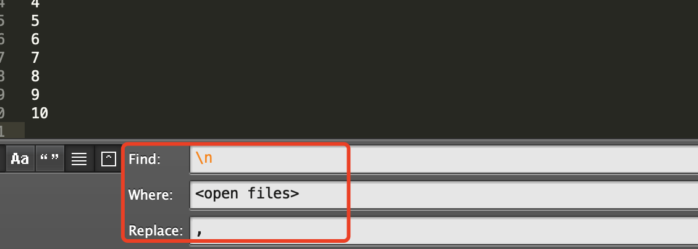
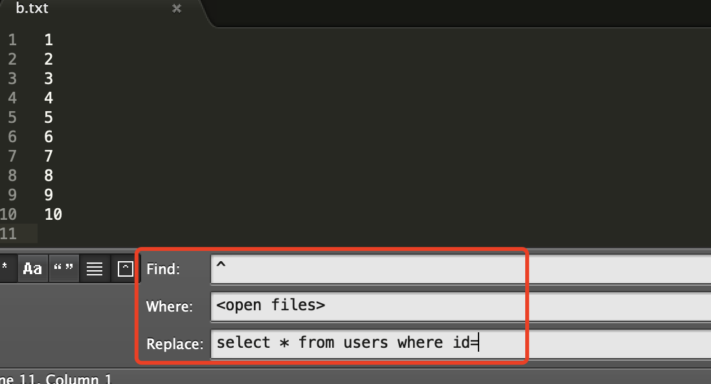
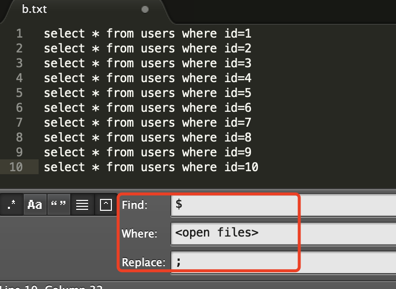

# 1.正则表达式介绍

## 1.命令简介

| 符号 | 说明                                                         |
| ---- | ------------------------------------------------------------ |
| ^    | 匹配输入字符串的开始位置，如果在方括号中使用，代表不接受该方括号表达式中的字符集合。 |
| $    | 匹配输入字符串的结尾位置                                     |
| .    | 匹配除换行符 \n 之外的任何单字符                             |
| +    | 匹配前面的子表达式一次或多次；需要扩展正则，即 grep -E 或者 egrep |
| *    | 匹配前面的子表达式零次或多次                                 |
| ?    | 匹配前面的子表达式零次或一次，或指明一个非贪婪限定符；需要扩展正则，即 grep -E 或者 egrep |
| \|   | 指明两项之间的一个选择                                       |
| {    | 标记限定符表达式的开始                                       |
| [    | 标记一个中括号表达式的开始                                   |


## 2.用法示例

### 1.linux相关命令使用

#### 1.制作数据

```bash
111
222
333

aaa
bbb
ccc

abc
113
1.3
1223
aab
abb
bbc
bcc
abc123
123abc
AbC
```

#### 2.场景演练-正则表达式

> --color  参数是为了查看符合正则表达式的字符，便于演示用，下同。

##### 1.查找含有数字/字母的行

```bash
cat c.txt| grep '[0-9]'  --color  ## 查找含有数字的行
cat c.txt| grep '[a-z|A-Z|0-9]'  --color ## 查找含有数字或字母的行
```

> - [] 匹配一个指定范围内的字符
> - [条件一|条件二|条件三|条件N] ，竖线 | 分割的数据，是逻辑运算 或的关系，满足一个条件即可。

##### 2.查找含有非数字的行

```bash
cat c.txt| grep '[^0-9]'  --color
```

> [^] 匹配一个不在指定范围内的字符

##### 3.查找以数字开头的行

```bash
cat c.txt| grep '^[0-9]'  --color 
```

> ^ 放到中括号里面和外面的含义不同。
>
> - 放到[]里面，指的是不含有[]里面的值
> - 放到[]外面，指的是以[]里面的值开头

##### 4.查询以数字/字母结尾的行

```bash
cat c.txt| grep '3$'  --color ## 查找以数字3结尾的行
cat c.txt| grep '[0-9]$'  --color  ## 查找以任意数字结尾的行
cat c.txt| grep '[0-9|a-z]$'  --color ## 查找以任意数字，或者小写字母结尾的行
```

##### 5.查找不是以数字/字母结尾的行

```bash
cat c.txt| grep '[^0-9]$'  --color # 不是以数字结尾的行
cat c.txt| grep '[^a-z|A-Z]$'  --color # 不是以数字/字母结尾，执行顺序为： ^((a-z)|(A-Z))
```

> ^ 放到中括号内，代表不以后面内容开头的数据

##### 6.查找不是以xx开头的行

```bash
 cat c.txt| grep '^[^0-9]' --color # 不是以数字开头的行 
```

> - [] 外面的 ^， 代表以后面内容开头；
> - []里面的^，代表不是 0-9 （即数字）的条件。
>
> ===> 综合起来，就是。不是以 0-9 开头的行，即不是数字开头的行。

##### 7.至少匹配n次

```bash
cat c.txt| grep '[0-9]\{2\}'  --color # 匹配至少2次，不超过4次数字的行。 {} 在shell中有特殊含义，需要使用反斜杠转义。
cat c.txt| grep '[0-9]\{2,\}'  --color  # 匹配至少出现2次的行
```

##### 8.匹配空行

```bash
cat c.txt | grep -n '^$' #  -n 是为了显示行号
```

> ^$ 代表空行。
>
> ====> 以结尾符号开头的行  ==> 空行

#### 3.扩展正则表达式

1. 当需要匹配 + 或者 ? 的正则表达式含义时，需要使用扩展表达式；
2. 对于grep，使用扩展正则表达式的方式有两种： `grep -E` 或者 `egrep`；

```bash
cat c.txt| grep -E '1[2|1]+3'   # 或者使用 cat c.txt| grep -E '1[1|2]+3' --color 
======> 匹配结果：
113
1223
abc123
123abc
```


> **解释：**
>
> - 含有数字1
> - 数字1后面，跟着数字1或者数字2，并且至少出现一次；11，12，122都符合
> - [2|1]+ 匹配完毕后，是数字3 
> - -E 指的是 使用扩展正则表达式来构建模式。

#### 4.忽略正则表达式(查找含有数字1.3的行)

有些场景下，不需要使用正则表达式，可以使用 `grep -F` 或者 `fgrep`

示例一：

```bash
cat c.txt | grep '1.3' --color   # 默认会当成正则表达式处理，即.代表任意一个字符
======> 执行结果：
113
1.3
abc123
123abc
```

示例二：

```bash
cat c.txt | grep -F '1.3' --color   # 添加-F参数，则忽略正则表达式
=======> 执行结果：
1.3
```

> -F 指的是忽略正则表达式，完全匹配后面的字符。示例中的. 就纯粹的代表字符 . 


### 2.文本编辑工具-sublime Text

#### 1.制作数据

```bash
for i in {1..10} ; echo $i >> b.txt ## 循环10次，将数字写入到b.txt中
```

#### 2.场景演练

1. b.txt中是订单号，需要拼接为一个sql

   1. 将所有换行符替换为逗号

   

   > **参数说明：**
   >
   > Find: 设置值为 "\n" ，代表换行符，也就是需要对换行符做替换操作
   >
   > Where:  设置的是<open files> 也是就只对当前打开的文件进行替换操作。（如果想替换文件夹下的所有文件，可以通过 Add open Folders 来添加。
   >
   > Replace：设置为"," 含义是将换行符\n替换为逗号。

   2. 替换后的效果：

      ```bash
      1,2,3,4,5,6,7,8,9,10,
      ```

   3. 稍微做下修正，即可拼接为完整的sql

      ```bash
      select * from users where id in (1,2,3,4,5,6,7,8,9,10) ;
      ```

2. 将每行，拼接为一个sql

   1. 在每行的最前端添加sql前缀

      

   > **参数说明：**
   >
   > Find : ^ 代表每行的开头。
   >
   > 其余参照前面示例。

   2. 执行步骤后的效果如下：

      ```bash
      select * from users where id=1
      select * from users where id=2
      select * from users where id=3
      select * from users where id=4
      select * from users where id=5
      select * from users where id=6
      select * from users where id=7
      select * from users where id=8
      select * from users where id=9
      select * from users where id=10
      ```

   3. 在行尾添加其他字符

      

      > **参数说明：**
      >
      > $ 是每行行尾。上面的示例是，在每行的行尾，添加分号;

   4. 执行后的效果如下：

      ```bash
      select * from users where id=1;
      select * from users where id=2;
      select * from users where id=3;
      select * from users where id=4;
      select * from users where id=5;
      select * from users where id=6;
      select * from users where id=7;
      select * from users where id=8;
      select * from users where id=9;
      select * from users where id=10;
      ```

      

